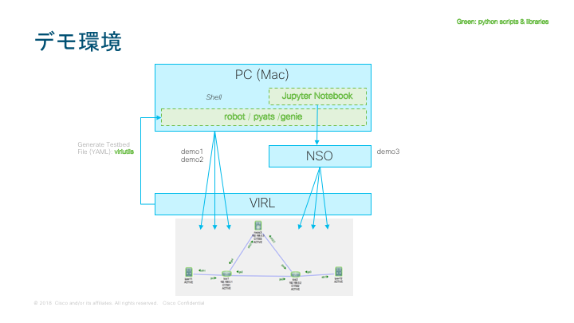
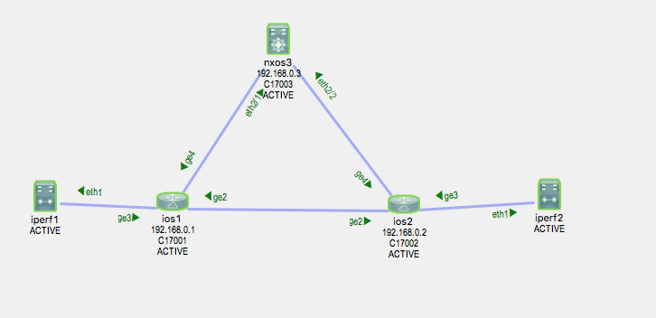
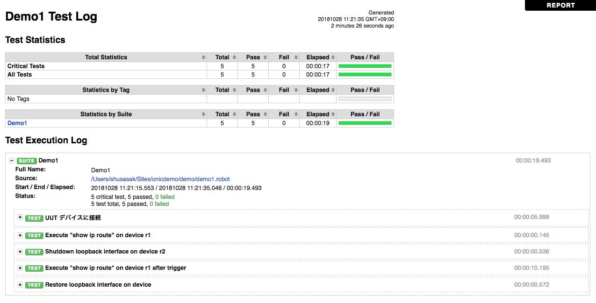
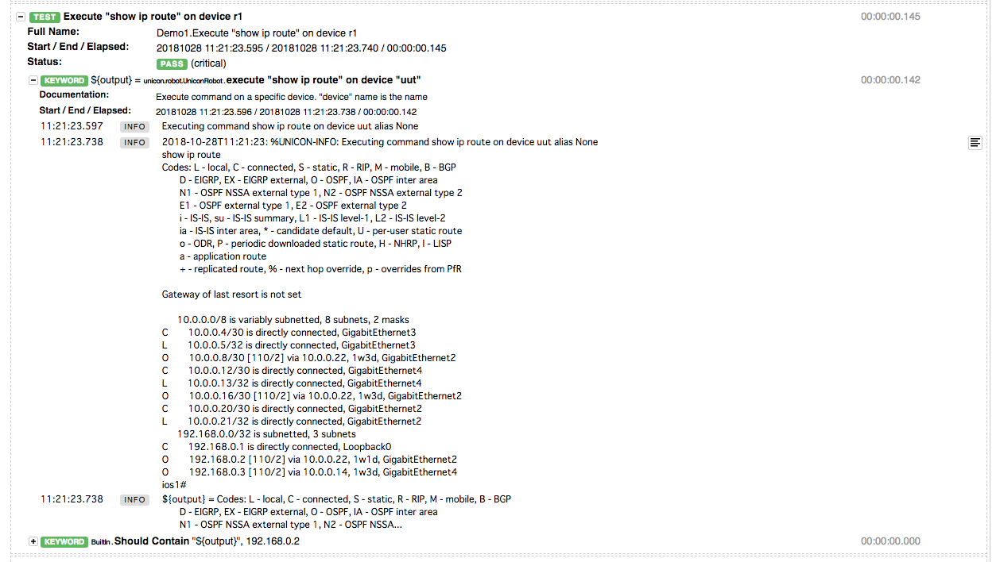

# Demo for ONIC 2018

ONIC 2018 講演 [1] で行った pyATS + NSO + VIRL のデモ用のレポジトリです

[1] http://onic.jp/program-detail/#s05

講演資料はこちら: [PDF][775e7e8b]

  [775e7e8b]: ./presentations/onic2018_cisco_netdevops_pyats_nso_ss_v1.1.pdf "PDF"

この README ファイルはデモを実行するための情報を記載しています。個別の技術については以下を参照してください。

- pyATS の概要についてはこちら: https://developer.cisco.com/site/pyats/

- NSO についてはこちら: https://developer.cisco.com/docs/nso/#!getting-nso/getting-nso

- VIRL についてはこちら: https://developer.cisco.com/site/virl/


## デモ環境 要件

- PC 上での python 3 実行環境
- インターネット接続
	- git clone, pip の実行のため
- VIRL サーバ
    - ESXi などの仮想環境上の VM として動作させる必要があります
- NSO サーバ
    - Linux 上にインストールします


## 今回のデモ環境
必ずしもこの環境でなくてはいけないわけではありません。

- Client
	- MacBook Pro, macOS 10.13.6
	- Python 3.4.7 (virtualenv)
    	- Note: 3.4 以降であれば動くはずだが、3.6 の若いバージョンでは動作しなかったことがあるので注意
	- pyenv

- Servers
	- VIRL VM (1.5.154) - 24vCPU, 128GB DRAM
    	- Note: VM が3~4台程度動けばよい。ここまでのスペックは実際には不要
    	- Mac 上の VMware Fusion 上の VIRL でもデモ可能（パフォーマンスに注意）
	- ESXi 6.0 update 3
    	- Note: VIRL が動作すれば問題ない
	- NSO 4.7.1
    	- Ubuntu 14.04 LTS 上で動作
    	- `apt install make gcc ant openjdk-8-jdk`
    	- Mac 上で動作させても問題ない


## インストール＆セットアップ

### Python 環境の準備 @ Mac

- 今回は pyenv を利用します
	- セットアップ方法は https://qiita.com/koooooo/items/b21d87ffe2b56d0c589b を参照のこと

作業ディレクトリ
```
cd; mkdir onicdemo
cd onicdemo
```

環境セットアップ
```
pyenv local 3.4.7
pip install --upgrade pip
pip install virtualenv
virtualenv venv
source venv/bin/activate
```

- 今後は常にこの virtualenv 環境で作業する。別のターミナルを新しく開いた場合も毎回 source コマンドを実行するのを忘れないこと

- Git レポジトリをクローン

```
git clone https://github.com/radiantmarch/onic2018demo.git demo

```

- 必要な python ライブラリのインストール
```
cd demo
pip install -r requirements.txt

```

- (参考) インストールするライブラリ一覧 (requirements.txt の中身)
```
pyats
genie
genie.libs.robot
jupyter
virlutils
```


### VIRL のインストール

- ブログを参照してください: https://qiita.com/radiantmarch/items/a3c0685d8a4c7468e878

- 公式ガイドは http://virl.cisco.com/

インストール後、デモを実行する PC から VIRL に接続できるようにしておいてください


### NSO のインストール

- NSO を購入していない場合、NSO のトライアル版がこちらからダウンロードできます [Getting NSO][9316747d]

  [9316747d]: https://developer.cisco.com/docs/nso/#!getting-nso/getting-nso "Getting NSO"

    - トライアル版に付属している NED は最新版ではなく制限がありますのでご注意ください。
    - [2018/11/6 追記] [Cisco Japan Blog](https://gblogs.cisco.com/jp/2018/11/getting-nso/) に評価版 NSO の解説が掲載されました

- インストール方法については、Cisco Community にガイドがありますので参照してください [NSO How To Install][449aed00]

  [449aed00]: https://community.cisco.com/t5/%E3%83%8D%E3%83%83%E3%83%88%E3%83%AF%E3%83%BC%E3%82%AF%E3%82%A4%E3%83%B3%E3%83%95%E3%83%A9%E3%82%B9%E3%83%88%E3%83%A9%E3%82%AF%E3%83%81%E3%83%A3-%E3%83%89%E3%82%AD%E3%83%A5%E3%83%A1%E3%83%B3%E3%83%88/nso-%E3%82%A4%E3%83%B3%E3%82%B9%E3%83%88%E3%83%BC%E3%83%AB%E6%96%B9%E6%B3%95/ta-p/3164587 "NSO How To Install"


- NSO をインストールする先のログイン情報は username: cisco passwor: cisco にしておきます。お使いの環境で異なる場合は、この先の設定を適宜読み替えてください


- NSO インストール後、ランタイムディレクトリを作成します
```
cd
ncs-setup --dest ncs-run
cd ncs-run
```

- ncs.conf ファイルを編集します。変更内容:
    - デフォルトの Syntax スタイルを c (cisco) にします
    - ssh port 2024 版で NSO CLI に直接接続できるようにします

```xml
<cli>
  <enabled>true</enabled>
  <style>c</style>
  <ssh>
    <enabled>true</enabled>
    <ip>0.0.0.0</ip>
    <port>2024</port>
  </ssh>
```

- デモ用 PC から NSO に接続できるか確認します
`ssh -l cisco -p 2024 {NSO_IP}`


- cisco-ios および cisco-nx の NED を packages ディレクトリに展開・配置しておきます
- 注: 評価版を利用している場合は、NSO のインストールディレクトリ配下の packages/neds にあるものを利用してください

```bash
$ pwd
/home/cisco/ncs-run/packages
$ ls
cisco-ios  cisco-nx
```

- NSO CLI にアクセスして NED を読み込みます

```bash
ncs_cli -u admin
packages reload
```

- 以下のように result true が表示されていれば成功です
```
reload-result {
    package cisco-ios
    result true
}
```


## デモ準備

- 前提: 上記のインストールまで終わっていること

- 環境の確認



### VIRL & NSO 準備

- VIRL 環境変数を設定
    - {VIRL_IP} に自身の環境に合わせた値を設定してください

```bash
export VIRL_HOST={VIRL_IP}
export VIRL_USERNAME=guest
export VIRL_PASSWORD=guest
```

- VIRL トポロジファイルの確認

```bash
cat topology.virl
```


- VIRL シミュレーションの起動
```bash
cd; cd onicdemo/demo
virl ls
virl up
(起動まで待機)
virl nodes
(すべてのノードが ACTIVE 表示され、REACHABLE になれば OK)
(Note: nxos3 については REACHABLE にならない場合がありますがそのまま進めてOK)
```

- VIRL トポロジから pyATS 用テストベッドファイルを生成

```bash
virl generate pyats
=> default_testbed.yaml ファイルが生成される
```


- NSO 環境変数の設定
    - {NSO_IP} を自身の環境のものと合わせる

```bash
export NSO_HOST={NSO_IP}
export NSO_USERNAME=cisco
export NSO_PASSWORD=cisco
```

- VIRL トポロジから NSO にデバイスを登録
    - Note: nxos3 は失敗することがあります。そのまま進めてOK)

```bash
virl generate nso --syncfrom
```

- これで、NSO に VIRL で動作する 3台のデバイスが登録され、sync-from まで完了します。


### テストベッドファイルを環境に合わせて修正

- 上記で生成した `default_testbed.yaml` をエディタで編集します
- tacacs セクションと passwords セクションを環境変数形式でなく、すべて直打ちで cisco に変更します

```yaml
    tacacs:
        username: cisco
    passwords:
        tacacs: cisco
        enable: cisco
        line: cisco
```

- devices: セクション内の ios1 の alias を uut に変更する
    - 必須。uut が無いと robot 実行時に KeyError が出てしまうようです。出展は確認中です [TODO]

```yaml
    ios1:
      alias: uut
```

- devices: セクション内に NSO に接続するためのセクションを追加する
    - {NSO IP Address} の部分を実際の IP アドレスに書き換えてください

```yaml
nso:
  os: nso
  type: nso
  tacacs:
    username: admin
  passwords:
    tacacs: admin
    line: admin
    enable: admin
  connections:
    defaults:
      class: unicon.Unicon
      via: cli
    con:
      command: ncs_cli -C
    cli:
      protocol: ssh
      ip: {NSO IP Address}
      port: 2024
```


### その他の準備

- デモ用PC 上で GNU ツールが使えるようにする (Mac の場合)
    - `brew install coreutils`

- デモ用PC 上で、robot コマンドでログを生成できるように Alias でオプションを設定
    - Mac でない場合は gdate の部分を適宜修正してください

```
alias robot='robot -d archive/$(LC_ALL=C gdate +"%Y%m%d_%H%M%S")'
```

- Jupyter ノートブックを起動 (動作確認とデモ3 で利用する)
`jupyter-notebook &`

- ブラウザが開くので `ONIC Demo Note.ipynb` を開く

- ノートブックの上から順番にコマンドを実行し、成功することを確認する
    - **Note**: テスト後にそれぞれのデバイスからセッション切断することを忘れない。例) `ios1.disconnect()`
    - セッションを切断していないと、このセッションがコンソール接続を専有してしまい、このあとの robot コマンドでの接続が失敗します。


## デモ手順

### デモ1: Unicon Library を利用したプログラミング的デバイス操作と試験

- VIRL client (VM Maestro)でトポロジを確認




- `demo1-scenario.txt` でデモの流れを確認
- `demo1.robot` ファイルを確認

- robot コマンドでテストを実行
```
robot demo1.robot
```

- 出力例 (一部出力を省略***しています)
```
(venv)***$ robot demo1.robot
==============================================================================
Demo1
==============================================================================
UUT デバイスに接続                                                    | PASS |
------------------------------------------------------------------------------
Execute "show ip route" on device r1                                  | PASS |
------------------------------------------------------------------------------
Shutdown loopback interface on device r2                              | PASS |
------------------------------------------------------------------------------
Execute "show ip route" on device r1 after trigger                    Waiting 10 seconds for routing convergence...
Execute "show ip route" on device r1 after trigger                    | PASS |
------------------------------------------------------------------------------
Restore loopback interface on device                                  | PASS |
------------------------------------------------------------------------------
Demo1                                                                 | PASS |
5 critical tests, 5 passed, 0 failed
5 tests total, 5 passed, 0 failed
==============================================================================
Output:  ***onicdemo/demo/archive/20181028_112114/output.xml
Log:     ***onicdemo/demo/archive/20181028_112114/log.html
Report:  ***onicdemo/demo/archive/20181028_112114/report.html
```

- 出力されたレポートを確認
`open ~/onicdemo/demo/archive/20181028_112114/log.html`

- レポート例


図: Robot ファイルで定義した通りにテストが実行され、セクションごとにログが整理されている


図: IOS でのコマンド実行結果


- **サマリー**
    - robot フレームワークとその裏で動作する pyATS/Unicon ライブラリを利用して、ルータに接続しコマンドを実行
    - コマンド出力に基づいてテストを行い Pass/Fail の判定を出力
    - ログやテスト結果が自動的にレポート出力される


### デモ2: Genie Parser Library を利用したデバイスステートの取得と検証

- 前置き
    - デモ1 でやったのは show ip route の出力を単純にテキスト処理して、成功・失敗を判定。
    - 実際のテストではコマンド出力をもっと詳しく
    - デモ2 では bgp コマンド

- `demo2.robot` の確認

- robot コマンドでテストを実行
`robot demo2.robot`

- 出力例. このデモではあえて JSON 出力をコンソールログにも表示させています
```
(venv)***$ robot demo2.robot
==============================================================================
Demo2
==============================================================================
UUT デバイスに接続                                                    | PASS |
------------------------------------------------------------------------------
Execute and parse "show bgp all neighbor" on IOS-XE                   ...
Original JSON
{"list_of_neighbors": ["192.168.0.2", "192.168.0.3"], "vrf": {"default": {"neighbor": {"192.168.0.3": {"bgp_session_transport": {"unread_input_bytes": 0, "tcp_path_mtu_discovery": "enabled", "irs": 1011041344, "outgoing_ttl": 255, "connection_state": "estab", "packet_slow_path": 0, "fast_lock_acquisition_failures": 0, "ip_precedence_value": 6, "rib_route_ip": "192.168.0.3", "rcvnxt": 1011325784, "status_flags": "active open", "maximum_output_segment_queue_size": 50, "maxrcvwnd": 16384, "datagram": {"datagram_sent": {"value": 31381, "total_data": 313142, "with_data": 16476, "partialack": 0, "fastretransmit": 0, "retransmit": 1, "second_congestion": 0}, "datagram_received": {"value": 31405, "out_of_order": 0, "total_data": 284439, "with_data": 14964}}, "ecn_connection": "disabled", "rtv": 3, "option_flags": "nagle, path mtu capable", "rcvwnd": 16251, "delrcvwnd": 133, "packet_fast_processed": 0, "lock_slow_path": 0, "receive_idletime": 16091, "krtt": 0, "packet_fast_path": 0, "rtto": 1003, "rcv_scale": 0, "sndnxt": 1787674355, "uptime": 897731238, "io_status": 1, "connection_tableid": 0, "max_rtt": 1000, "tcp_semaphore": "0x7F13DBB0A550", "ack_hold": 200, "graceful_restart": "disabled", "min_time_between_advertisement_runs": 0, "connection": {"last_reset": "never", "established": 1, "dropped": 0}, "minimum_incoming_ttl": 0, "srtt": 1000, "sndwnd": 16616, "tcp_semaphore_status": "FREE", "transport": {"local_port": "11809", "local_host": "192.168.0.1", "mss": 536, "foreign_host": "192.168.0.3", "foreign_port": "179"}, "min_rtt": 11, "address_tracking_status": "enabled", "iss": 1787361212, "enqueued_packets": {"mis_ordered_packet": 0, "input_packet": 0, "retransmit_packet": 0}, "snduna": 1787674355, "sent_idletime": 15890, "snd_scale": 0}, "bgp_event_timer": {"next": {"retrans": "0x0", "timewait": "0x0", "sendwnd": "0x0", "giveup": "0x0", "processq": "0x0", "keepalive": "0x0", "pmtuager": "0x0", "deadwait": "0x0", "ackhold": "0x0", "linger": "0x0"}, "starts": {"retrans": 16476, "timewait": 0, "sendwnd": 0, "giveup": 0, "processq": 0, "keepalive": 0, "pmtuager": 1, "deadwait": 0, "ackhold": 14965, "linger": 0}, "wakeups": {"retrans": 1, "timewait": 0, "sendwnd": 0, "giveup": 0, "processq": 0, "keepalive": 0, "pmtuager": 1, "deadwait": 0, "ackhold": 14387, "linger": 0}}, "address_family": {"ipv4 unicast": {"last_write": "00:00:44", "session_state": "established", "current_time": "0x358591A1", "up_time": "1w3d", "last_read": "00:00:16"}}, "bgp_negotiated_capabilities": {"four_octets_asn": "advertised and received", "route_refresh": "advertised and received(new)", "graceful_restart": "received", "enhanced_refresh": "advertised", "graceful_restart_af_advertised_by_peer": "IPv4 Unicast (was not preserved", "ipv4_unicast": "advertised and received", "graceful_remote_restart_timer": 120, "stateful_switchover": "NO for session 1"}, "bgp_neighbor_counters": {"messages": {"received": {"total": 14966, "route_refresh": 0, "notifications": 0, "updates": 2, "opens": 1, "keepalives": 14963}, "out_queue_depth": 0, "sent": {"total": 16477, "route_refresh": 0, "notifications": 0, "updates": 2, "opens": 1, "keepalives": 16474}, "in_queue_depth": 0}}, "bgp_version": 4, "remote_as": 1, "bgp_negotiated_keepalive_timers": {"hold_time": 180, "keepalive_interval": 60}, "link": "internal", "description": "iBGP peer nxos3", "router_id": "192.168.0.3", "session_state": "established"}, "192.168.0.2": {"bgp_session_transport": {"unread_input_bytes": 0, "tcp_path_mtu_discovery": "enabled", "irs": 2394978386, "outgoing_ttl": 255, "connection_state": "estab", "packet_slow_path": 0, "fast_lock_acquisition_failures": 0, "ip_precedence_value": 6, "rib_route_ip": "192.168.0.2", "rcvnxt": 2395291740, "status_flags": "active open", "maximum_output_segment_queue_size": 50, "maxrcvwnd": 16384, "datagram": {"datagram_sent": {"value": 32861, "total_data": 312819, "with_data": 16459, "partialack": 0, "fastretransmit": 0, "retransmit": 3, "second_congestion": 0}, "datagram_received": {"value": 32884, "out_of_order": 0, "total_data": 313353, "with_data": 16475}}, "ecn_connection": "disabled", "rtv": 3, "option_flags": "nagle, path mtu capable", "rcvwnd": 16137, "delrcvwnd": 247, "packet_fast_processed": 0, "lock_slow_path": 0, "receive_idletime": 34233, "krtt": 0, "packet_fast_path": 0, "rtto": 1003, "rcv_scale": 0, "sndnxt": 3323724142, "uptime": 897717921, "io_status": 1, "connection_tableid": 0, "max_rtt": 1000, "tcp_semaphore": "0x7F13DBB0A480", "ack_hold": 200, "graceful_restart": "disabled", "min_time_between_advertisement_runs": 0, "connection": {"last_reset": "never", "established": 1, "dropped": 0}, "minimum_incoming_ttl": 0, "srtt": 1000, "sndwnd": 15187, "tcp_semaphore_status": "FREE", "transport": {"local_port": "44433", "local_host": "192.168.0.1", "mss": 1460, "foreign_host": "192.168.0.2", "foreign_port": "179"}, "min_rtt": 0, "address_tracking_status": "enabled", "iss": 3323411322, "enqueued_packets": {"mis_ordered_packet": 0, "input_packet": 0, "retransmit_packet": 0}, "snduna": 3323724142, "sent_idletime": 34434, "snd_scale": 0}, "bgp_event_timer": {"next": {"retrans": "0x0", "timewait": "0x0", "sendwnd": "0x0", "giveup": "0x0", "processq": "0x0", "keepalive": "0x0", "pmtuager": "0x0", "deadwait": "0x0", "ackhold": "0x0", "linger": "0x0"}, "starts": {"retrans": 16463, "timewait": 0, "sendwnd": 0, "giveup": 0, "processq": 0, "keepalive": 0, "pmtuager": 118003, "deadwait": 0, "ackhold": 16475, "linger": 0}, "wakeups": {"retrans": 3, "timewait": 0, "sendwnd": 0, "giveup": 0, "processq": 0, "keepalive": 0, "pmtuager": 118003, "deadwait": 0, "ackhold": 16170, "linger": 0}}, "address_family": {"ipv4 unicast": {"last_write": "00:00:34", "session_state": "established", "current_time": "0x358591A0", "up_time": "1w3d", "last_read": "00:00:45"}}, "bgp_negotiated_capabilities": {"ipv4_unicast": "advertised and received", "route_refresh": "advertised and received(new)", "stateful_switchover": "NO for session 1", "enhanced_refresh": "advertised and received", "four_octets_asn": "advertised and received"}, "bgp_neighbor_counters": {"messages": {"received": {"total": 16476, "route_refresh": 0, "notifications": 0, "updates": 12, "opens": 1, "keepalives": 16463}, "out_queue_depth": 0, "sent": {"total": 16460, "route_refresh": 0, "notifications": 0, "updates": 2, "opens": 1, "keepalives": 16457}, "in_queue_depth": 0}}, "bgp_version": 4, "remote_as": 1, "bgp_negotiated_keepalive_timers": {"hold_time": 180, "keepalive_interval": 60}, "link": "internal", "description": "iBGP peer ios2", "router_id": "192.168.0.2", "session_state": "established"}}}}}
..
Neighbors List
['192.168.0.2', '192.168.0.3']
Execute and parse "show bgp all neighbor" on IOS-XE                   | PASS |
------------------------------------------------------------------------------
Demo2                                                                 | PASS |
2 critical tests, 2 passed, 0 failed
2 tests total, 2 passed, 0 failed
==============================================================================
Output:  ***onicdemo/demo/archive/20181028_113639/output.xml
Log:     ***onicdemo/demo/archive/20181028_113639/log.html
Report:  ***onicdemo/demo/archive/20181028_113639/report.html
```

- 出力の中の Original JSON のテキストを https://jsonformatter.curiousconcept.com/ などで整形して確認
    - list_of_neighbors をキーとするエントリに、ネイバーのリストが表示されている

- **ポイント**
    - Genie ライブラリの一つである Parser の _genie.libs.parser.show_bgp.ShowBgpAllNeighbors_ を使ってコマンド出力をパース
    - 通常のテキスト出力では抽出が難しい情報も、構造化データ (JSON) で取得できる
    - Genie ライブラリには、こうした Parser の他に、特定機能のテストに必要なコンフィグ変更を実行してくれる Trigger や、テスト実行後の正常性判定をしてくれる Verifier も備えている。


### デモ3: NSO を利用したネットワーク全体の設定変更と試験 & ロールバック

- 前置き
    - デモ1, デモ2 では、テスト後、元の状態に戻す（ロールバックする）ためのコマンドをわざわざ投入していた
    - NSO 経由でデバイスを設定すればロールバックが簡単にできる（それだけがメリットではないけれど）

- Jupyter Notebook を開く (デモ準備で開いている)

- "NSOへの接続（デモ3)" のセクションへ移動しテストを実行

- コマンド実行が成功することを確認

- ロールバックができることを確認。画面例:


- **ポイント**
    - NSO を使うことで、テスト環境のロールバックが可能。
    - そのほか、コンフィグ時のエラーハンドリングなど、pyATS だけでは面倒な処理を NSO に代行してもらえる
    - NSO はデバイスにコマンドを投入するために使うだけではなく、商用ネットワークへのサービスコンフィグ投入（例：VPN への新規顧客の追加など）の用途で使われる。商用ネットワークで行われる操作と同じことをテストするためには NSO を利用するのがよい


## Reference
参考リンクをまとめます

- pyATS 開発に携わる日本人 (@ccieojisan) による、関連情報まとめページ
    - [Link](https://ccieojisan.net/post-1664/)

- pyATS Unicon ライブラリでサポートしているプラットフォーム一覧
    - [Link](https://pubhub.devnetcloud.com/media/pyats-packages/docs/unicon/user_guide/introduction.html#supported-platforms)
    - Linux なども操作可能

- Genie ライブラリでサポートしているプラットフォームについて
    - IOS-XE, NXOS, IOS-XR だが、ライブラリによって異なる。
    - Conf/Ops/SDK/Robot ライブラリの場合 https://github.com/CiscoTestAutomation/genielibs
    - Parser の場合 https://github.com/CiscoTestAutomation/genieparser/tree/master/src/genie/libs/parser


## Disclaimer | 免責事項
- 本項は予告なく改定することがあります。あらかじめご了承ください。
- 本レポジトリの再利用は自由です。ただし、本レポジトリのファイルを使用したことによる一切の損害について、開発者は責任を負いません。
- 本レポジトリは開発者が個人の立場で作成・メンテナンスしているものであり、Cisco Systems 社とは一切関係ありません。

## Privacy Policy | プライバシーポリシー
- 本項は予告なく改定することがあります。あらかじめご了承ください。
- 開発者は、法的要請その他の相応の理由がある場合を除いて、第三者にユーザの個人情報を提供しません。


<!--  -->
